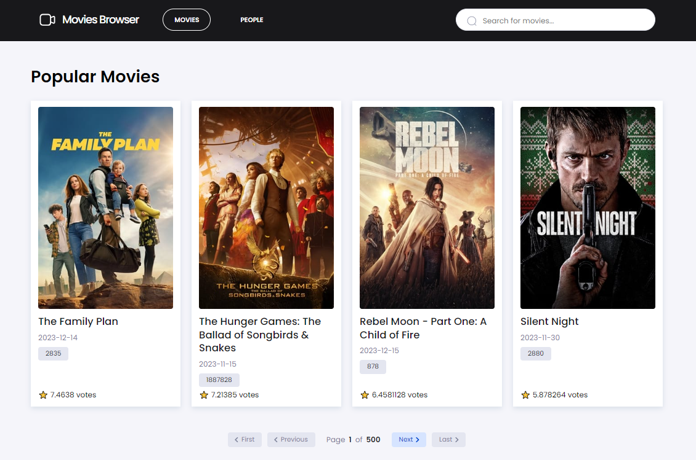

# **MOVIES BROWSER**

Welcome to our Movies Browser project! We're excited to have you here at the early stages of our app development journey. Be sure to check back soon as we continue to enhance and refine the experience.

## Demo
Explore our current progress on the live demo: https://bedicooper.github.io/movies-browser/

## Authors
- [Patrycja Gomza](https://github.com/patrycja-gomza)
- [Michał Wodniczak](https://github.com/widmo200)
- [Mateusz Bednarz](https://github.com/bedicooper)

## General Info
### Overview
Movies Browser is a web application developed in collaboration with the YouCode online school. Our teamwork is organized using Scrum, and we manage tasks through Trello. For design, we utilize Figma, and data for the app is sourced from The Movie Database API.

### Features
- **Popular Movie Lists:** Explore a curated selection of popular movies on our main homepage.
- **Movie Details:** Click on a movie from the popular lists to view detailed.
- **List of Actors:** Discover a list of actors and click on each one to explore more details.

### What We Are Working On
- **Actor Page:** Explore details about different actors.
- **Loading and Error States:** Our app gracefully handles loading and error states for a smoother user experience.
- **Search Functionality:** Utilize the input for searching movies based on query parameters.
- **Responsiveness:** Ensuring a seamless experience on various devices, from mobile phones to tablets.

### Development Workflow
#### Project Bootstrapping 🚧
This project was bootstrapped with [Create React App](https://github.com/facebook/create-react-app), using the [Redux](https://redux.js.org/) and [Redux Toolkit](https://redux-toolkit.js.org/) template.

#### State Management 🔄
Leveraging Redux for state management, including middleware for asynchronous operations.

#### Styling 💅
Utilizing JSX, Flexbox, CSS Grid, and Styled Components for an appealing and responsive design.

#### Asynchronous Operations ⏳
Implementing asynchronous functionality using Axios, Async/Await, and Redux-Saga.

#### Inspiration 💡
This project draws inspiration from the "Frontend Developer from the Basics" course at the online programming school YouCode.

## Technologies
This project incorporates a variety of technologies and tools, including but not limited to:
- JSX (JavaScript XML) 
- Flexbox 
- CSS Grid
- JavaScript ES6+ Features
- React.js
- Create React App (Webpack, Babel, ESLint, PostCSS, CSS Loader & Style Loader)
- React Router (including BrowserRouter, Route, Switch, and NavLink for navigation)
- Styled components (utilization of syntax with template literals)
- Media Queries
- Immutability with the immer library in Redux (for state management)
- Custom Hooks
- Local Storage with Redux-Saga
- Redux (utilizing actions, reducers, and middleware for asynchronous operations) 
- JavaScript generator functions (pause and resume functions), providing a mechanism for powerful asynchronous programming 
- URL-related features like URLSearchParams, useLocation, useHistory: React Router and React Hooks for working with and manipulating the browser's URL
- Axios
- Async/Await
- API Integration

Feel free to explore the demo and join us on this exciting journey of building the Movies Browser! If you have any questions or suggestions, don't hesitate to reach out. Thank you for your interest and support!

## Available Scripts
In the project directory, you can run:

#### `npm start`
Runs the app in the development mode.\
Open [http://localhost:3000](http://localhost:3000) to view it in your browser.

The page will reload when you make changes.\
You may also see any lint errors in the console.

#### `npm run build`
Builds the app for production to the `build` folder.\
It correctly bundles React in production mode and optimizes the build for the best performance.

The build is minified and the filenames include the hashes.\
Your app is ready to be deployed!

See the section about [deployment](https://facebook.github.io/create-react-app/docs/deployment) for more information.

#### `npm run eject`
**Note: this is a one-way operation. Once you `eject`, you can't go back!**

If you aren't satisfied with the build tool and configuration choices, you can `eject` at any time. This command will remove the single build dependency from your project.

Instead, it will copy all the configuration files and the transitive dependencies (webpack, Babel, ESLint, etc) right into your project so you have full control over them. All of the commands except `eject` will still work, but they will point to the copied scripts so you can tweak them. At this point you're on your own.

You don't have to ever use `eject`. The curated feature set is suitable for small and middle deployments, and you shouldn't feel obligated to use this feature. However we understand that this tool wouldn't be useful if you couldn't customize it when you are ready for it.